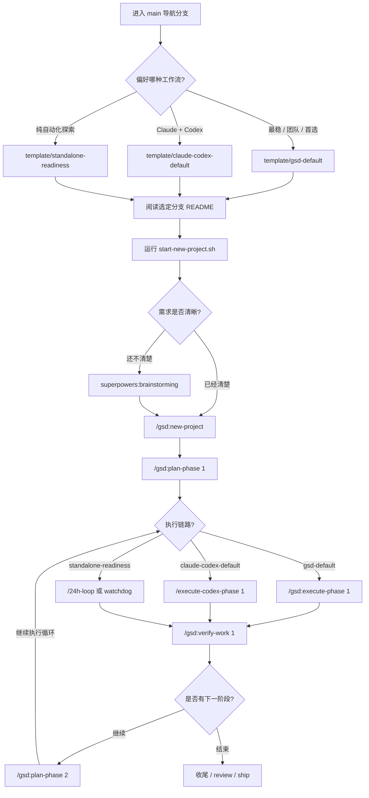

# 🔮 VibeTemplate: 多模态 Agent 工作流仓库


> **🚀 欢迎来到 VibeTemplate**  
> 这个仓库不是一个单一的项目模板，而是一个**多模板导航仓库**。  
> `main` 分支的唯一职责，就是**帮助你挑选并进入最适合你的开发模式分支**。真正带有项目结构和代码的开发模板在对应的子分支中。

---

## 🧭 选哪条模板分支？(核心选型矩阵)

根据你对稳定性、人工介入程度和模型执行器的偏好，选择下方最适合您的分支结构：

| 分支名 (`git switch ...`) | 核心理念 | 推荐适用场景 | 特点 & 权衡 |
| :--- | :--- | :--- | :--- |
| **`template/gsd-default`**<br>*(推荐起点)* | **最稳定、完全原生的 GSD 体验** | - 正式产品项目<br>- 长期稳定维护<br>- 初次接触 GSD | **最稳妥。** 复用 GSD 所有原生能力，执行链路统一 (phase -> commit -> UAT)，无需维护第三方执行脚本。 |
| **`template/claude-codex-default`** | **高级桥接：Claude 规划 + Codex 落地** | - 个人极客项目<br>- 在意用量成本<br>- 快速原型的 Agent 项目 | **高阶极客选型。** 让昂贵的 Claude 仅做高价值决策，将干活下放给 Codex，依靠 Codex Runner 作为默认执行层。 |
| **`template/standalone-readiness`** | **独立部署：144h 无人值守试验田** | - 全自动化尝试<br>- 本地大模型独立系统开发 | **最前沿探索。** 构建面向完全无人干预、极致独立的自动化架构体系。|

---

## 🗺️ 总流程图

如果你更习惯先看全局图，再决定走哪条路径，就看这张：



---

## 🚀 极简操作：一键切入与启动

不知道选哪个？**默认选 `template/gsd-default` 绝对不会出错。**

### 1️⃣ 切到对应分支
```bash
# GSD 默认流 (最稳定推荐)
git switch template/gsd-default

# Claude → Codex 高阶默认流
git switch template/claude-codex-default

# Standalone 独立模式流
git switch template/standalone-readiness
```

### 2️⃣ 启动你的新项目
进入你选定的分支后，请**直接查看该分支专有的 `README.md`**，里面包含了详细完整的项目初始化与执行指南。

每个分支都已自带：
- 📖 新项目零距离启动流程
- 🧩 强烈建议安装的 AI 技能 (Skills)
- ⚙️ 工作流命令一览表

---

## 🧠 一句话记忆法 (以 GSD 主干为例)

即使是最复杂的架构，我们也都收敛到了以下 5 行命令：

```text
/gsd:new-project        # 正式立项与生成状态大脑
/gsd:plan-phase N       # 拆解复杂的当前 Phase
/gsd:execute-phase N    # 将 Phase 计划无情落地
/gsd:verify-work N      # 严格验证交付形态
/gsd:progress           # 迷茫时看一眼进度
```

💭 **前期模糊时？**
在正式立项前，你可以依靠 `superpowers:brainstorming` 先理清需求脉络。

---

## 🧩 GSD + superpowers 最佳实践

很多人第一次接触这两套东西时，会以为它们在做同一件事。

其实最稳的用法不是二选一，而是分层：

### GSD 负责主干

负责这些事情：

- 项目立项
- `.planning/` 状态管理
- phase 拆分
- phase 执行
- 进度查看
- UAT 验收

也就是：

```text
/gsd:new-project
/gsd:plan-phase N
/gsd:execute-phase N
/gsd:verify-work N
/gsd:progress
```

### superpowers 负责增强

负责这些事情：

- 需求模糊时的前置澄清
- 方案设计和实现计划细化
- 更严格的质量门
- 分支收尾

也就是：

- `superpowers:brainstorming`
- `superpowers:writing-plans`
- `superpowers:executing-plans`
- `superpowers:requesting-code-review`
- `superpowers:verification-before-completion`
- `superpowers:finishing-a-development-branch`

### 一句话理解

- `GSD` = 项目骨架
- `superpowers` = 方法论和质量增强

如果你是新手，最简单就是：

1. 需求不清楚时，先 `superpowers:brainstorming`
2. 正式开始后，主流程交给 GSD
3. 想加更严格质量门时，再补 `superpowers`

---

## 📚 开源模板项目参考

如果你以后想升级自己的工作流，这几套开源模板都值得知道。它们定位差异很大，不是“都差不多”。

### 1. gstack

GitHub：

- https://github.com/garrytan/gstack

定位：

- Garry Tan 风格的多角色工作流
- 更像“虚拟团队”而不是单技能工具

适合：

- 创始人
- 产品型开发者
- 想快速推生产代码的人

### 2. BMAD

GitHub：

- https://github.com/bmad-code-org/BMAD-METHOD

定位：

- 把 Agile 方法论完整搬进 AI 工作流

适合：

- 团队
- 中大型项目
- 需要结构化协作的人

### 3. shanraisshan

GitHub：

- https://github.com/shanraisshan/claude-code-best-practice

定位：

- 最像“课程”的最佳实践模板
- 适合系统学习 Claude Code 的正确打开方式

适合：

- 想减少踩坑的新手
- 想直接 clone 一套实践规则的人

### 4. davila7

GitHub：

- https://github.com/davila7/claude-code-templates

定位：

- 更像模板和组件市场

适合：

- 想快速试不同组件的人
- 想自己拼装工作流的人

### 5. oh-my-claudecode

GitHub：

- https://github.com/Yeachan-Heo/oh-my-claudecode

定位：

- 多代理、多模型并行
- 更偏“武器库”

适合：

- 复杂项目
- 想玩多模型协作的人

### 6. superpowers

GitHub：

- https://github.com/obra/superpowers

定位：

- 方法论最强
- 技能框架可扩展性最好

适合：

- 想长期构建自己技能库的人
- 重视 TDD、调试、协作方法论的人

### 7. everythingclaude

GitHub：

- https://github.com/affaan-m/everything-claude-code

定位：

- 性能优化很强
- 更偏重度使用者的长期稳定性

适合：

- 追求性能
- 高频重度使用 Claude Code 的人

### 8. get-shit-done

GitHub：

- https://github.com/gsd-build/get-shit-done

定位：

- 轻量
- 直接出活
- 用 `PROJECT.md / STATE.md` 解决上下文腐烂

适合：

- solo 开发者
- 小团队
- 不想搞一堆企业流程的人

### 我对这 8 套的建议

如果你只想要一句实话：

- 新手入门：`shanraisshan` + `davila7`
- 想快速出活：`get-shit-done`
- 想把方法论做扎实：`superpowers`
- 想多模型并行：`oh-my-claudecode`
- 想创始人式高压推进：`gstack`

### 不要贪多

最实用的建议还是：

- 不要一口气装 8 套
- 选 1 到 2 套深度使用
- 真正常驻的通常只有主干一套 + 补充一套

这个仓库当前的思路就是：

- 主干：`GSD`
- 增强：`superpowers`

---

## 🗂 仓库核心结构说明

本仓库包含如下关键分支树，各分支彼此独立，代码互不干扰：

- 📂 **`main`**   *(你目前在这里: 导航页与指引)*
- 📂 **`template/gsd-default`**   *(✅ 首选: 原生的 GSD 默认体验)* 
- 📂 **`template/claude-codex-default`** *(⚡ 进阶: Claude 规划 / Codex 强效干活)*
- 📂 **`template/standalone-readiness`** *(🔬 前沿: 混合型全自动化底座)*

> **💡 温馨提示**：如果你只是把此仓库作为一个展示或者参考库分享，请保持 `main` 为默认分支；如果你自己要开展新业务，请根据上方指南迅速 `switch` 到对应的模板分支去大显身手吧！
